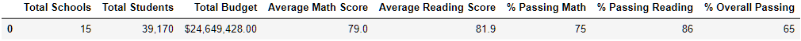
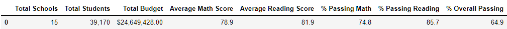
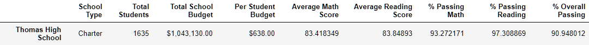
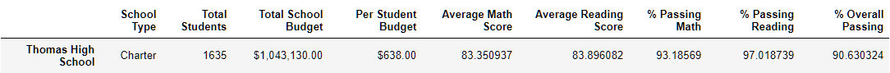
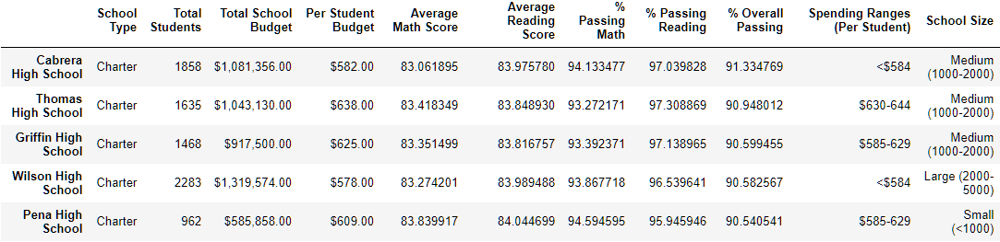
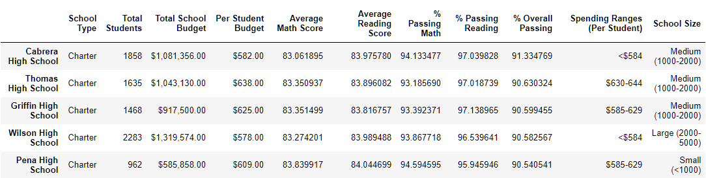
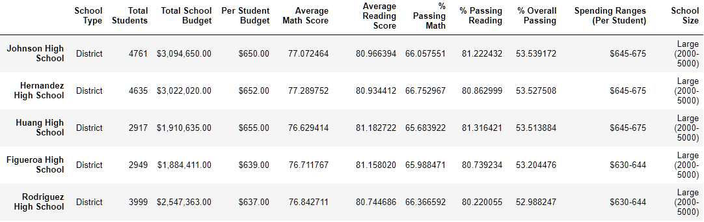
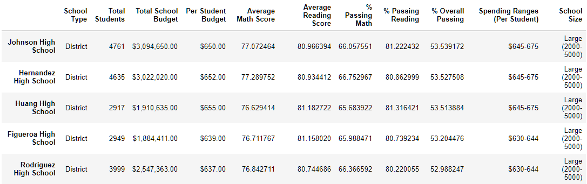

# School_District_Analysis

# Overview
The purpose of this analysis is to see how removing fraudulent grades from our original dataset would impact the resulting analysis. The removed data points were the reading and math grades for all students in the 9th grade at Thomas High School. An indentical analysis was then undertaken so that the impact on the results could be compared to our original analysis

# Results
In the following list we've compiled the results of original analysis and the updated analysis, respectively :

* District Summary: 
  * Original: 
  * Updated: 
* School Summary (The only altered row is that for Thomas High School so it is inlcuded here but the full data frames can also be viewed: [original](./Resources/Orig_School_Summary.png) and [updated](./Resources/Refact_School_Summary.png)
  * Original: 
  * Updated: 
* Top 5 Performing Schools:
  * Original: 
  * Updated: 
* Bottom 5 Performing Schools: 
  * Original: 
  * Updated: 
# Summary
