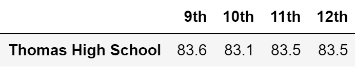
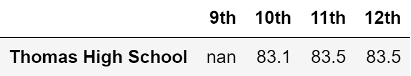
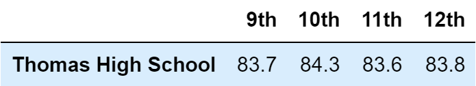
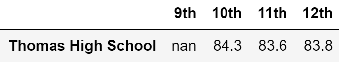
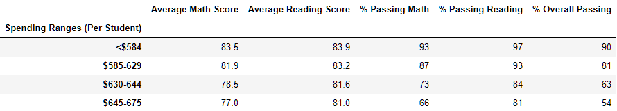
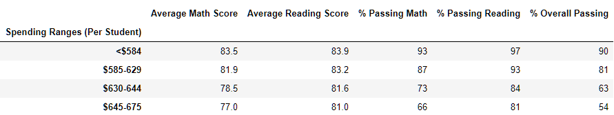
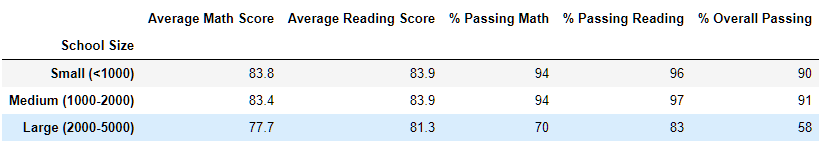
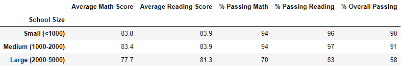
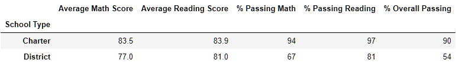
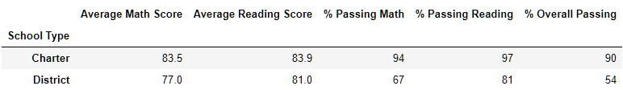

# School_District_Analysis

## Overview
The purpose of this analysis is to see how removing fraudulent grades from our original dataset would impact the resulting analysis. The removed data points were the reading and math grades for all students in the 9th grade at Thomas High School. An indentical analysis was then undertaken so that the impact on the results could be compared to our original analysis

## Results
In the following list we've compiled the results of original analysis and the updated analysis, respectively :

* District Summary: 
  * Original: 
  * Updated: 
* School Summary (The only altered row is that for Thomas High School so it is inlcuded here but the full data frames can also be viewed: [original](./Resources/Orig_School_Summary.png) and [updated](./Resources/Refact_School_Summary.png)
  * Original: 
  * Updated: 
* Top 5 Performing Schools:
  * Original: 
  * Updated: 
* Bottom 5 Performing Schools: (since Thomas has not moved to the bottom 5 schools, the [updated](./Resources/Refact_Bottom_5) and [original](./Resources/Orig_Bottom_5) DataFrames are identical, as such we've decided to only display one copy below)
  * Original and Updated: 
* Math Scores by Grade (Again since only Thomas High School has been affected we will display the relevent rows, but see here for the [updated](./Resources/Refact_Math_Grades.png) and [original](./Resources/Orig_Math_Grades.png)):
  * Original: 
  * Updated: 
* Reading Scores by Grade (full [updated](./Resources/Refact_Reading_Grades.png) and [original](./Resources/Orig_Reading_Grades.png) DataFrames):
  * Original: 
  * Updated: 
* Scores by Spending:
  * Original: 
  * Updated: 
* Scores by School Size:
  * Original: 
  * Updated: 
* Scores by School Type:
  * Original: 
  * Updated: 
## Summary
When reviewing the data an obvious change is the reduction in the scores and average reading percents across the whole school district (which can be seen in the first point of the above list). Additionally when we review the scores for Thomas High School in particular we see that the average reading and math scores, as well as the percentages passing those subjects have all decreased by an amount roughly proportional to the decrease in scores across the district. The most obvious change is the replacement of the 9th grade scores for math and reading with `nan` in the math and reading scores by grade data frames. The impact on the scores by school size, type, and per student spending is more subtle. Since the grades in these DataFrames have been rounded to the nearest whole percent and the grades were only impacted by roughly .1-.3%, the resulting DataFrames appear identical. However when we view the DataFrames before the rounding is applied we do see a decrease for each category which Thomas High School falls into. Overall the impact on the average scores is not statistically significant so the exclusion of these scores leads to roughly the same conclusions; for example Thomas High School is still the 2nd highest school in terms of Overall Passing Percentage.
